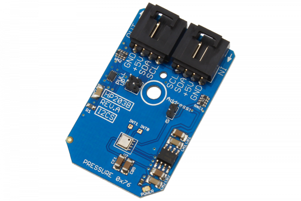

[](https://store.ncd.io/product/hp203b-precision-barometer-and-altimeter-sensor-i2c-mini-module/).

# HP203B

The HDC10Manufactured by Hope Microelectronics, the HP203B is a high-precision barometer and altimeter that measures the pressure and the temperature by an internal 24-bit ADC and compensates using a patented algorithm.00 is a digital humidity sensor with an integrated temperature sensor that provides excellent measurement accuracy at very low power.The device measures humidity based on a novel capacitive sensor. The humidity and temperature sensors are factory calibrated.
This Device is available from www.ncd.io

[SKU: HP203B]

(https://store.ncd.io/product/hp203b-precision-barometer-and-altimeter-sensor-i2c-mini-module/)
This Sample code can be used with Raspberry Pi.

Hardware needed to interface HP203B barometer and altimeter sensor With Raspberry Pi :

1. <a href="https://store.ncd.io/product/hp203b-precision-barometer-and-altimeter-sensor-i2c-mini-module/">HP203B barometer and altimeter sensor</a>

2. <a href="https://store.ncd.io/product/i2c-shield-for-raspberry-pi-3-pi2-with-outward-facing-i2c-port-terminates-over-hdmi-port/">Raspberry Pi I2C Shield</a>

3. <a href="https://store.ncd.io/product/i%C2%B2c-cable/">I2C Cable</a>

## Python

Download and install smbus library on Raspberry pi. Steps to install smbus are provided at:

https://pypi.python.org/pypi/smbus-cffi/0.5.1

Download (or git pull) the code in pi. Run the program.

```cpp
$> python HP203B.py
```
The lib is a sample library, you will need to calibrate the sensor according to your application requirement.

